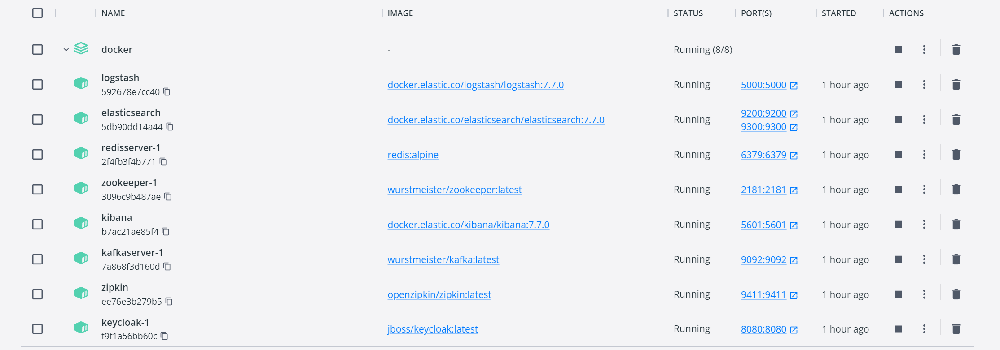

# 《Spring微服务实战》（第二版）学习笔记

该书的源码地址：https://github.com/ihuaylupo/manning-smia

## 项目结构
<pre>
ch01----------------------------------------------第1章欢迎迈入云世界Spring
ch03----------------------------------------------第3章使用SpringBoot构建微服务
ch05----------------------------------------------第5章使用Spring Cloud Config服务器端控制配置
ch06----------------------------------------------第6章关于服务发现
ch07----------------------------------------------第7章当糟糕的事情发生时：使用Spring Cloud和Resilience4j的弹性模式
ch08----------------------------------------------第8章使用Spring Cloud Gateway进行服务路由
ch09----------------------------------------------第9章保护微服务
ch10----------------------------------------------第10章使用Spring Cloud Stream的事件驱动架构
ch11----------------------------------------------第11章使用Spring Cloud Sleuth和Zipkin进行分布式跟踪
docker--------------------------------------------Docker配置相关
|   +---config-----------------------------------------logstash配置
|   +---data-------------------------------------------Postgres数据库表脚本
|   +---keycloak---------------------------------------Keycloak配置文件
|   +---docker-compose.yml-----------------------------镜像创建与容器执行脚本
</pre>

## 环境版本（截止2022年11月17日）
- JDK：11.0.10
- Spring Boot 版本：2.3.7.RELEASE
- Spring Cloud 版本：Hoxton.SR9（2.2.6.RELEASE）
- org.json 版本：20190722
- logstash-logback-encoder 版本：7.2
- resilience4j 版本：1.7.1
- lombok 版本：1.18.20
- spring-cloud-stream 版本：3.0.9.RELEASE
- spring-cloud-starter-stream-kafka 版本：3.0.0.RELEASE
- keycloak-adapter-bom 版本：20.0.0
- Postgresql：Windows-x64 15.1-1

## 注意事项
以下主要是Windows的本地调试与部署的配置
1. 需要搭建一个Postgres，执行data文件下的脚本，不建议使用教材中的postgres镜像

2. 在`hosts`文件中添加
```text
127.0.0.1 eurekaserver
127.0.0.1 keycloak
127.0.0.1 kafka
127.0.0.1 redis
127.0.0.1 gateway
127.0.0.1 elasticsearch
127.0.0.1 logstash
127.0.0.1 zipkin
```

3. 第9章需要执行docker-compose命令，启动Keycloak，正常启动后，可以访问链接：http://keycloak:8080/auth
```shell
cd docker
docker-compose -f docker-compose.yml up
```
启动之后，可以自动导入Keycloak的`realm-export.json`的配置，但仍需要手动配置Users，配置密码的时候注意关闭`Temporary`

4. 第10章中直接使用docker-compose命令可以完成zookeeper、kafak和redis的搭建
```shell
cd docker
docker-compose -f docker-compose.yml up
```



## 学习总结

&emsp;&emsp;《Spring微服务实战》（第2版）这本书以Ostock项目案例，通过许可证服务和组织服务的构建和逐步扩展，介绍了Spring家族中的各种组件，包括Spring Cloud中的Config、Eureka、LoadBalancer、Feign、Gateway、Stream、Sleuth、Zipkin，还包括Resilience4j（保护微服务所使用的各种模式）、Keycloak（服务验证和授权）、Kafka（消息队列）、Redis（数据缓存）、ELK等组件。讲解服务配置、路由模式、服务网关、服务验证和授权、异步消息、日志关联聚合和跟踪等内容，笔者在学习这些组件后，也有了相当多的知识和实践体验。